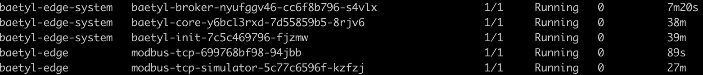
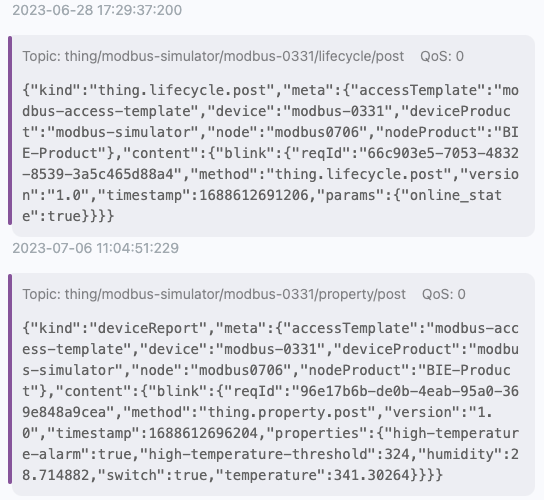

# modbus v2

## 简介
modbus v2版本需要切换到branch_v2.0.0分支，该版本主要定义了以下三个概念：
1. 设备：设备是真实物理设备在云端的映射。云端每个设备对应一个物理设备。
2. 物模型：物模型提供对一类设备的统一定义，包括设备的属性，测点和接入协议等信息。通过使用设备模型作为模板可以创建同一类型的多个设备。
3. 接入模板：设备接入模板是针对一种类型设备的接入方式的模板，相同接入方式的设备，可以复用同一个模板。其主要用于定义同一类设备的设备点表与物模型之间的映射关系。

下面会介绍如何使用Baetyl下发Modbus模拟器及对应驱动，同时通过baetyl-broker观测采集结果。

## 创建Modbus模拟器应用

首先，你需要POST调用`/v1/nodes`创建一个节点，在下面的使用示例中，我们创建了一个名为`mmodbus0706`的节点，注意修改请求中的selector字段，来将它修改为你自己的节点名称。

```json
{
  "accelerator": "",
  "name": "modbus0706",
  "description": "",
  "cluster": false,
  "authType": "CERT",
  "labels": {},
  "sysApps": [],
  "nodeMode": "kube"
}
```

我们提供了Modbus tcp的模拟器镜像，通过POST调用`/v1/apps`来创建一个名为`modbus-tcp-simulator`的应用。
通过hostport将模拟器的5020端口映射出来。

```json
{
    "name": "modbus-tcp-simulator",
    "mode": "kube",
    "type": "container",
    "labels": {},
    "selector": "baetyl-node-name=modbus0706",
    "services": [
        {
            "name": "baetyl-modbus-tcp-simulator",
            "image": "docker.io/baetyltech/modbus-simulator:v1.0.0",
            "ports": [
                {
                    "hostPort": 5020,
                    "containerPort": 5020,
                    "protocol": "TCP"
                }
            ],
            "args": [
                "modbus",
                "tcp"
            ],
            "replica": 1,
            "jobConfig": {
                "restartPolicy": "Never"
            }
        }
    ],
    "system": false,
    "cronStatus": 0,
    "cronTime": "2023-07-06T02:13:45Z",
    "replica": 1,
    "workload": "deployment",
    "jobConfig": {
        "completions": 0,
        "restartPolicy": "Never"
    },
    "ota": {},
    "autoScaleCfg": {}
}
```

## 修改Broker应用配置

[baetyl-broker](https://github.com/hannatao/baetyl-broker)是Baetyl提供的端侧mqtt broker，所有使用Baetyl下发的应用程序，都会在容器内`/var/lib/baetyl/system/certs`目录下提供由baetyl-core签发的，可以直接使用mqtts连接baetyl-broker。

因此，如果你想使用mqtt box等其它应用使用mqtt用户名密码进行连接，需要对于broker进行一些配置操作。

首先使用GET访问`/v1/nodes/{nodeName}`接口，获取到broker应用的名称`baetyl-broker-xxxxx`。

然后通过GET访问`/v1/apps/{brokerAppName}`接口，获取到默认配置项的名称`baetyl-broker-conf-xxxxx`。

通过PUT访问`/v1/config/baetyl-broker-conf-xxxxx`来修改broker的配置，增加除了默认mqtts外的连接方式。

修改主要位于`data->value->value`中。

```json
{
  "name": "baetyl-broker-conf-sf6we6zrw",
  "labels": {
    "baetyl-app-name": "baetyl-broker-nyufggv46",
    "baetyl-cloud-system": "true",
    "baetyl-node-name": "modbus0706"
  },
  "data": [
    {
      "key": "conf.yml",
      "value": {
        "type": "kv",
        "value": "listeners:\n  - address: 'tcp://0.0.0.0:8883'\nprincipals:\n  - username: test\n    password: test\n    permissions:\n      - action: pub\n        permit:\n          - '#'\n      - action: sub\n        permit:\n          - '#'\nsession:\n  sysTopics: [\"$link\", \"$baetyl\"]\nlogger:\n  level: debug\n  encoding: console\n  compress: true\n  maxAge: 10\n  maxSize: 10\n  maxBackups: 1"
      }
    }
  ]
}
```

上述配置中，我们新增了8883端口的mqtt服务，因此，需要修改baety-broker的端口配置，使用PUT调用`/v1/apps/{brokerAppName}`, 增加8883端口hostport映射到宿主机。

修改主要位于`services->ports`中新增的端口映射。

```json
{
  "name": "baetyl-broker-nyufggv46",
  "mode": "kube",
  "type": "container",
  "labels": {
    "baetyl-cloud-system": "true"
  },
  "selector": "baetyl-node-name=modbus0706",
  "services": [
    {
      "name": "baetyl-broker",
      "baseName": "",
      "image": "baetyltech/broker:v2.1.1",
      "volumeMounts": [
        {
          "name": "broker-conf",
          "mountPath": "/etc/baetyl",
          "subPath": "",
          "readOnly": true,
          "autoClean": false
        }
      ],
      "ports": [
        {
          "containerPort": 50010,
          "protocol": "TCP"
        },
        {
          "serviceType": "ClusterIP",
          "protocol": "TCP",
          "containerPort": 8883,
          "hostPort": 8883
        }
      ],
      "env": [],
      "command": [],
      "args": [],
      "devices": [],
      "resources": {
        "limits": {},
        "requests": {}
      },
      "security": {
        "privileged": false
      },
      "replica": 1
    }
  ],
  "volumes": [
    {
      "name": "broker-conf",
      "config": {
        "name": "baetyl-broker-conf-sf6we6zrw"
      }
    }
  ],
  "system": true,
  "cronStatus": 0,
  "cronTime": "2023-07-06T02:04:51Z",
  "replica": 1,
  "workload": "deployment",
  "jobConfig": {
    "completions": 0,
    "restartPolicy": "Never"
  },
  "ota": {},
  "autoScaleCfg": {},
  "initServices": [],
  "volumeMounts": []
}
```

完成上述操作后，你就可以使用mqtt box等连接工具，通过以下连接信息，连接到baetyl-broker了。

```yaml
address: mqtt://127.0.0.1:8883
username: test
password: test
```

## 创建配置项

现在，来创建配置项，通过POST方法调用`/v1/configs`接口，来创建配置项。

```json
{
  "name": "modbus-driver-conf",
  "data": [
    {
      "key": "access_template.yml",
      "value": {
        "type": "kv",
        "value": "modbus-access-template:\n  properties:\n  - name: 开关\n    id: \"1\"\n    type: bool\n    visitor:\n      modbus:\n        function: 1\n        address: \"0x1\"\n        quantity: 1\n        type: bool\n        scale: 0\n        swapByte: false\n        swapRegister: false\n    current: null\n    expect: null\n  - name: 温度\n    id: \"2\"\n    type: float32\n    visitor:\n      modbus:\n        function: 3\n        address: \"0x0\"\n        quantity: 2\n        type: float32\n        scale: 0\n        swapByte: false\n        swapRegister: false\n    current: null\n    expect: null\n  - name: 湿度\n    id: \"3\"\n    type: float32\n    visitor:\n      modbus:\n        function: 3\n        address: \"0x2\"\n        quantity: 2\n        type: float32\n        scale: 0\n        swapByte: false\n        swapRegister: false\n    current: null\n    expect: null\n  - name: 高温阈值\n    id: \"4\"\n    type: int32\n    visitor:\n      modbus:\n        function: 3\n        address: \"0x4\"\n        quantity: 2\n        type: int32\n        scale: 0\n        swapByte: false\n        swapRegister: false\n    current: null\n    expect: null\n  - name: 高温报警\n    id: \"5\"\n    type: bool\n    visitor:\n      modbus:\n        function: 1\n        address: \"0x0\"\n        quantity: 1\n        type: bool\n        scale: 0\n        swapByte: false\n        swapRegister: false\n    current: null\n    expect: null\n  mappings:\n  - attribute: switch\n    type: value\n    expression: x1\n    precision: 0\n    deviation: 0\n    silentWin: 0\n  - attribute: temperature\n    type: value\n    expression: x2\n    precision: 0\n    deviation: 0\n    silentWin: 0\n  - attribute: humidity\n    type: value\n    expression: x3\n    precision: 0\n    deviation: 0\n    silentWin: 0\n  - attribute: high-temperature-threshold\n    type: value\n    expression: x4\n    precision: 0\n    deviation: 0\n    silentWin: 0\n  - attribute: high-temperature-alarm\n    type: value\n    expression: x5\n    precision: 0\n    deviation: 0\n    silentWin: 0\n"
      }
    },
    {
      "key": "models.yml",
      "value": {
        "type": "kv",
        "value": "modbus-simulator:\n- name: switch\n  type: bool\n  mode: rw\n- name: temperature\n  type: float32\n  mode: ro\n- name: humidity\n  type: float32\n  mode: ro\n- name: high-temperature-threshold\n  type: int32\n  mode: rw\n- name: high-temperature-alarm\n  type: bool\n  mode: ro\n"
      }
    },
    {
      "key": "sub_devices.yml",
      "value": {
        "type": "kv",
        "value": "devices:\n- name: modbus-0331\n  version: 1680263365qc3fdv\n  deviceModel: modbus-simulator\n  accessTemplate: modbus-access-template\n  deviceTopic:\n    delta:\n      qos: 0\n      topic: thing/modbus-simulator/modbus-0331/property/invoke\n    report:\n      qos: 0\n      topic: thing/modbus-simulator/modbus-0331/property/post\n    event:\n      qos: 0\n      topic: thing/modbus-simulator/modbus-0331/raw/c2d\n    get:\n      qos: 0\n      topic: $baetyl/device/modbus-0331/get\n    getResponse:\n      qos: 0\n      topic: $baetyl/device/modbus-0331/getResponse\n    eventReport:\n      qos: 0\n      topic: thing/modbus-simulator/modbus-0331/event/post\n    propertyGet:\n      qos: 0\n      topic: thing/modbus-simulator/modbus-0331/property/get\n    lifecycleReport:\n      qos: 1\n      topic: thing/modbus-simulator/modbus-0331/lifecycle/post\n  accessConfig:\n    modbus:\n      id: 1\n      interval: 5s\n      tcp:\n        address: 127.0.0.1\n        port: 5020\ndriver: \"\"\n"
      }
    }
  ]
}
```

上述配置项，主要由三个文件组成：
1. access_template.yaml: properties字段定义设备点表，mappings字段定义设备点表与物模型测点间的映射关系。
```yaml
modbus-access-template:
  properties:
  - name: 开关
    id: "1"
    type: bool
    visitor:
      modbus:
        function: 1
        address: "0x1"
        quantity: 1
        type: bool
        scale: 0
        swapByte: false
        swapRegister: false
    current: null
    expect: null
  - name: 温度
    id: "2"
    type: float32
    visitor:
      modbus:
        function: 3
        address: "0x0"
        quantity: 2
        type: float32
        scale: 0
        swapByte: false
        swapRegister: false
    current: null
    expect: null
  - name: 湿度
    id: "3"
    type: float32
    visitor:
      modbus:
        function: 3
        address: "0x2"
        quantity: 2
        type: float32
        scale: 0
        swapByte: false
        swapRegister: false
    current: null
    expect: null
  - name: 高温阈值
    id: "4"
    type: int32
    visitor:
      modbus:
        function: 3
        address: "0x4"
        quantity: 2
        type: int32
        scale: 0
        swapByte: false
        swapRegister: false
    current: null
    expect: null
  - name: 高温报警
    id: "5"
    type: bool
    visitor:
      modbus:
        function: 1
        address: "0x0"
        quantity: 1
        type: bool
        scale: 0
        swapByte: false
        swapRegister: false
    current: null
    expect: null
  mappings:
  - attribute: switch
    type: value
    expression: x1
    precision: 0
    deviation: 0
    silentWin: 0
  - attribute: temperature
    type: value
    expression: x2
    precision: 0
    deviation: 0
    silentWin: 0
  - attribute: humidity
    type: value
    expression: x3
    precision: 0
    deviation: 0
    silentWin: 0
  - attribute: high-temperature-threshold
    type: value
    expression: x4
    precision: 0
    deviation: 0
    silentWin: 0
  - attribute: high-temperature-alarm
    type: value
    expression: x5
    precision: 0
    deviation: 0
    silentWin: 0
```

2. models.yaml: 定义物模型的测点，包含名称，数据类型以及只读或读写。
```yaml
modbus-access-template:
  properties:
  - name: 开关
    id: "1"
    type: bool
    visitor:
      modbus:
        function: 1
        address: "0x1"
        quantity: 1
        type: bool
        scale: 0
        swapByte: false
        swapRegister: false
    current: null
    expect: null
  - name: 温度
    id: "2"
    type: float32
    visitor:
      modbus:
        function: 3
        address: "0x0"
        quantity: 2
        type: float32
        scale: 0
        swapByte: false
        swapRegister: false
    current: null
    expect: null
  - name: 湿度
    id: "3"
    type: float32
    visitor:
      modbus:
        function: 3
        address: "0x2"
        quantity: 2
        type: float32
        scale: 0
        swapByte: false
        swapRegister: false
    current: null
    expect: null
  - name: 高温阈值
    id: "4"
    type: int32
    visitor:
      modbus:
        function: 3
        address: "0x4"
        quantity: 2
        type: int32
        scale: 0
        swapByte: false
        swapRegister: false
    current: null
    expect: null
  - name: 高温报警
    id: "5"
    type: bool
    visitor:
      modbus:
        function: 1
        address: "0x0"
        quantity: 1
        type: bool
        scale: 0
        swapByte: false
        swapRegister: false
    current: null
    expect: null
  mappings:
  - attribute: switch
    type: value
    expression: x1
    precision: 0
    deviation: 0
    silentWin: 0
  - attribute: temperature
    type: value
    expression: x2
    precision: 0
    deviation: 0
    silentWin: 0
  - attribute: humidity
    type: value
    expression: x3
    precision: 0
    deviation: 0
    silentWin: 0
  - attribute: high-temperature-threshold
    type: value
    expression: x4
    precision: 0
    deviation: 0
    silentWin: 0
  - attribute: high-temperature-alarm
    type: value
    expression: x5
    precision: 0
    deviation: 0
    silentWin: 0
```

3. sub_devices.yaml: 定义了设备的连接信息，采样频率，端侧进行数据上报的topic。
```yaml
devices:
- name: modbus-0331
  version: 1680263365qc3fdv
  deviceModel: modbus-simulator
  accessTemplate: modbus-access-template
  deviceTopic:
    delta:
      qos: 0
      topic: thing/modbus-simulator/modbus-0331/property/invoke
    report:
      qos: 0
      topic: thing/modbus-simulator/modbus-0331/property/post
    event:
      qos: 0
      topic: thing/modbus-simulator/modbus-0331/raw/c2d
    get:
      qos: 0
      topic: $baetyl/device/modbus-0331/get
    getResponse:
      qos: 0
      topic: $baetyl/device/modbus-0331/getResponse
    eventReport:
      qos: 0
      topic: thing/modbus-simulator/modbus-0331/event/post
    propertyGet:
      qos: 0
      topic: thing/modbus-simulator/modbus-0331/property/get
    lifecycleReport:
      qos: 1
      topic: thing/modbus-simulator/modbus-0331/lifecycle/post
  accessConfig:
    modbus:
      id: 1
      interval: 1m0s
      tcp:
        address: 172.18.4.177
        port: 5020
driver: ""
```

在上述配置中，需要根据实际情况，修改你的接入模板，物模型以及子设备中的连接地址。
由于所有的程序都运行在容器中，所以子设备中的127.0.0.1地址，应当修改成实际的IP。

## 创建Modbus应用

最后，使用POST调用`/v1/apps`创建Modbus应用，需要挂载系统`/dev`目录，
以及将刚刚创建的配置项挂载到`/etc/baetyl`目录，至此，所有云端配置创建完毕。

```json
{
  "name": "modbus-tcp",
  "mode": "kube",
  "type": "container",
  "selector": "baetyl-node-name=modbus0706",
  "services": [
    {
      "name": "modbus-baetyl-driver",
      "image": "docker.io/baetyltech/modbus:v2.2.5",
      "volumeMounts": [
        {
          "name": "device-path",
          "mountPath": "/dev"
        },
        {
          "name": "driver-conf",
          "mountPath": "/etc/baetyl"
        }
      ],
      "resources": {},
      "security": {
        "privileged": true
      },
      "replica": 1,
      "jobConfig": {
        "restartPolicy": "Never"
      }
    }
  ],
  "volumes": [
    {
      "name": "device-path",
      "hostPath": {
        "path": "/dev"
      }
    },
    {
      "name": "driver-conf",
      "config": {
        "name": "modbus-driver-conf"
      }
    }
  ],
  "cronStatus": 0,
  "cronTime": "2023-04-25T03:21:07Z",
  "dnsPolicy": "ClusterFirst",
  "replica": 1,
  "workload": "deployment",
  "jobConfig": {
    "completions": 0,
    "restartPolicy": "Never"
  },
  "ota": {},
  "autoScaleCfg": {}
}
```

## 验证

在端侧执行节点安装后，会发现有以下应用在运行中。



从mqttx中，我们也能收到由驱动上报的节点在线以及从模拟器中采集到的数据。



## 附

更多概念以及可视化操作页面，请参考：[BIE](https://cloud.baidu.com/doc/BIE/s/bl93wf5by)
